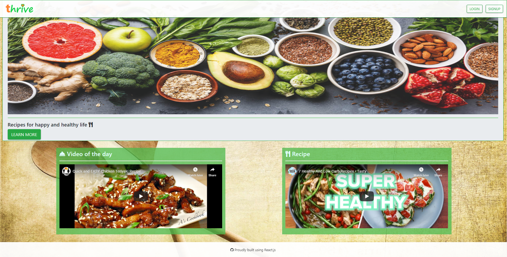
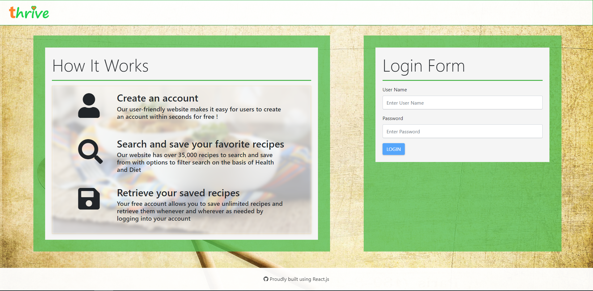
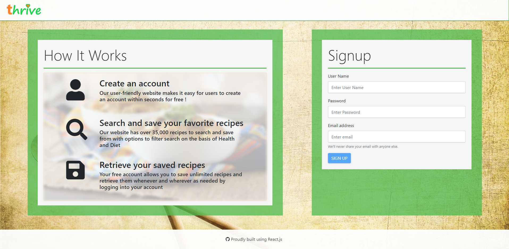
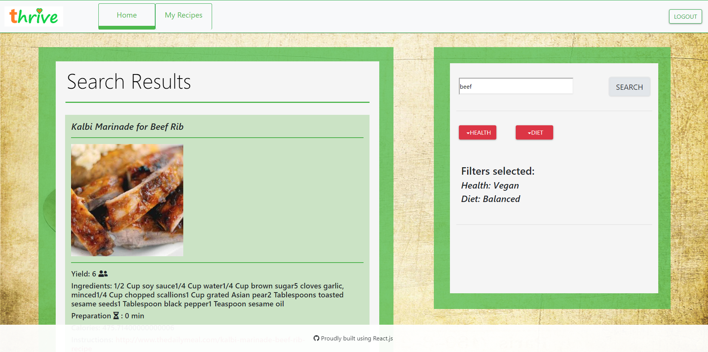
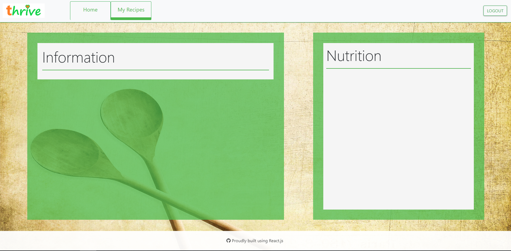

THRIVE
- The Complete Kitchen !   Version 1.0 Original Deployment Date: 3.25.2020

The Idea:
- Create an app that allow users to search and filter recipes and save their preferred recipes.
- With their account, a user can retrieve all the saved recipes in order use whenever needed.

User Guide:

- Front page gives option to SignUp and Login. Video of the Day and Random Recipe Video are available at the bottom.

- Click on Login and enter credentials to enter into User page

- Click on signup and enter credentials to create new acocount and direct to Login page

- Search by typing keywird for food and uses filters for Health and Diet if needed and save recipes from the results

- Click on 'My Recipes' to get list of all saved recipes associated with the user

Built Utilizing:
- HTML 
- Bootstrap CDN
- CSS
- Javascript/ jQuery
- Edamam API
- React
- Mongoose DB
- Font Awesome Icons
- MERN

Original Contributors:
- Andy Moore
- Eric Pinder
- Zachariah Thomas

Thrive in Development:
User Stories: 
1. As a user, I would like an app that allows me to search a recipe. 
- Acceptance Criteria: jQuery function to capture user click and return recipe list from Edamam.
2. As a user, I would like an interactive map that allows me filter my recipe on basis of Health and Diet. 
- Acceptance Criteria: jQuery function to capture filter information and move to the search api url.
3. As a user, I want to be able to save the recipes. 
- Acceptance Criteria: Selected recipe from search can be saved in Mongoose DB using POST route.
4. As a user, I want to be able to get all my saved recipes 
- Acceptance Criteria: Retrieve saved information from Mongoose DB using GET route.

Future Development:
- Profile picture for users
- Login Credentials confirmation
- Calendar to set recipe preparation reminder
- Enhanced Front-End View
